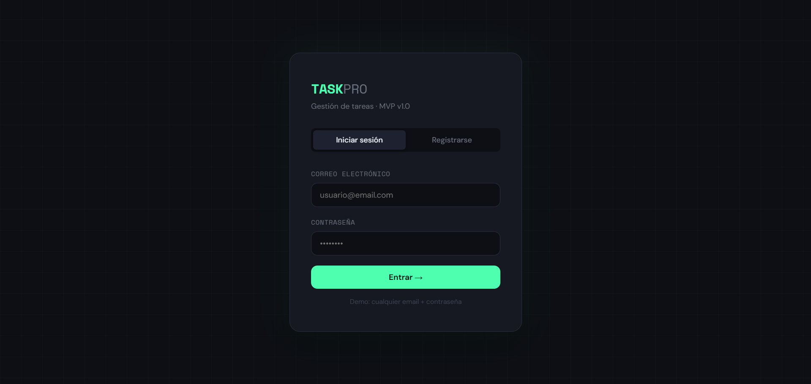
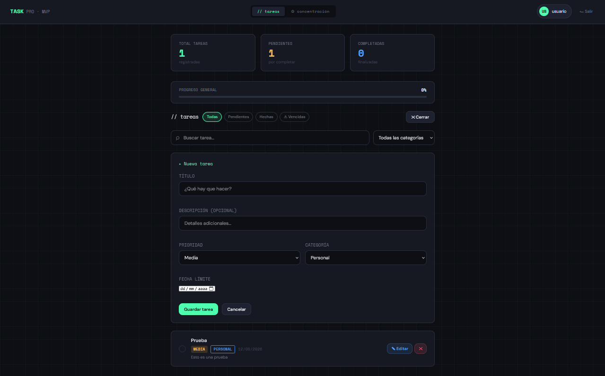
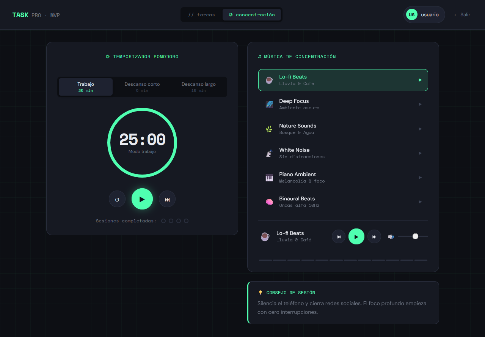

# TASKPRO · Gestión de Tareas


Aplicación web de gestión de tareas individuales desarrollada como MVP para el Proyecto Intermodular de 2º SMR. Permite registrarse, iniciar sesión y gestionar tareas con prioridades, categorías, fechas límite y una zona de concentración con temporizador Pomodoro.

---

## Capturas de pantalla

### Login


### Panel de tareas


### Zona de concentración


---

## Funcionalidades

- **Autenticación** — registro e inicio de sesión con validación
- **Gestión de tareas** — crear, editar, eliminar y marcar como completadas
- **Prioridades** — alta, media y baja con código de colores
- **Categorías** — Personal, Trabajo, Estudio y Otro
- **Fechas límite** — alerta visual automática cuando una tarea está vencida
- **Buscador** — filtra tareas en tiempo real por título o descripción
- **Filtros** — todas, pendientes, completadas, vencidas
- **Progreso** — barra visual con porcentaje de tareas completadas
- **Pomodoro** — temporizador con modos trabajo / pausa corta / pausa larga, duración personalizable y contador de sesiones
- **Música** — reproductor integrado con playlists de Spotify y YouTube, o URL personalizada

---

## Tecnologías

| Tecnología | Uso |
|---|---|
| HTML5 | Estructura de la aplicación |
| CSS3 | Estilos, diseño responsivo y animaciones |
| JavaScript ES6+ | Lógica de negocio, CRUD y temporizador |
| localStorage | Persistencia de datos en el navegador |
| Spotify Embed API | Reproductor de playlists |
| YouTube Embed | Reproductor de vídeos |
| Git / GitHub | Control de versiones |

---

## Estructura del proyecto

```
taskpro-mvp/
├── index.html           # Aplicación principal
├── css/styles.css       # Estilos de la aplicación
├── README.md
├── js/
│   └── app.js          # Lógica JavaScript
└── docs/
    └── capturas/
        ├── login.png
        ├── tareas.png
        └── concentracion.png
```

---

## Cómo ejecutarlo

No requiere instalación ni servidor. Basta con:

1. Clonar el repositorio
```bash
git clone https://github.com/Juan-Carlos-12/taskpro-mvp.git
```

2. Abrir `index.html` directamente en el navegador

> Los datos se guardan automáticamente en el `localStorage` del navegador.

---

## Estado del proyecto

| Funcionalidad | Estado |
|---|---|
| Login y registro | ✅ Completado |
| CRUD de tareas | ✅ Completado |
| Filtros y buscador | ✅ Completado |
| Barra de progreso | ✅ Completado |
| Alertas de vencimiento | ✅ Completado |
| Temporizador Pomodoro | ✅ Completado |
| Reproductor de música | ✅ Completado |
| Backend Django + API REST | 🔄 En desarrollo |
| Base de datos PostgreSQL | 🔄 En desarrollo |
| Despliegue en servidor | 🔄 Pendiente |

---

## Arquitectura prevista (entrega final)

El MVP actual funciona íntegramente en el frontend. La entrega final conectará la interfaz con un backend real:

```
Frontend (HTML + JS)
       ↓  fetch()
API REST (Django)
       ↓
Base de datos (SQLite → PostgreSQL)
```

---

## Autor

**Juan Carlos Ballesteros Garrido**  
2º SMR A · Proyecto Intermodular  
IES Virgen del Carmen

---

## Licencia

Este proyecto está bajo la licencia MIT. Consulta el archivo `LICENSE` para más información.
